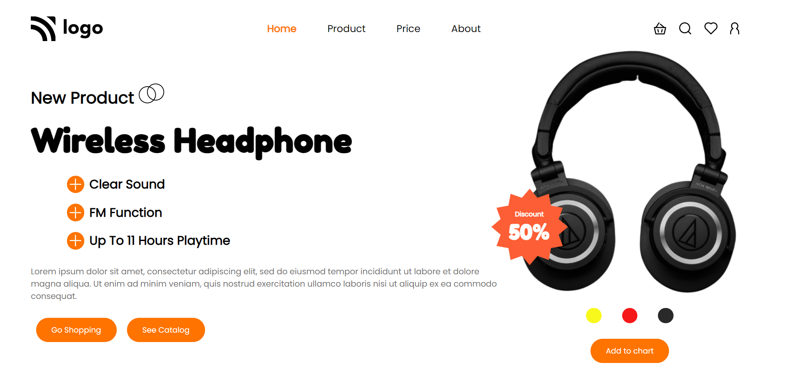

# Hey Welcome

Hi, My name is Uvesh Khatri and I have completed the 7th Project of the iNeuron Full Stack Course.

# Project 7

In this project i have created a Product Home Page. And i have learnt a lot of things like Position.

It took me 8  Hours to complete this project

### Mobile Responsive ✅

## Tech Stack Used 
- HTML5

- CSS

## My Project is looking like :

[Live Link](https://uveshkhatri-product-home-page.netlify.app/)